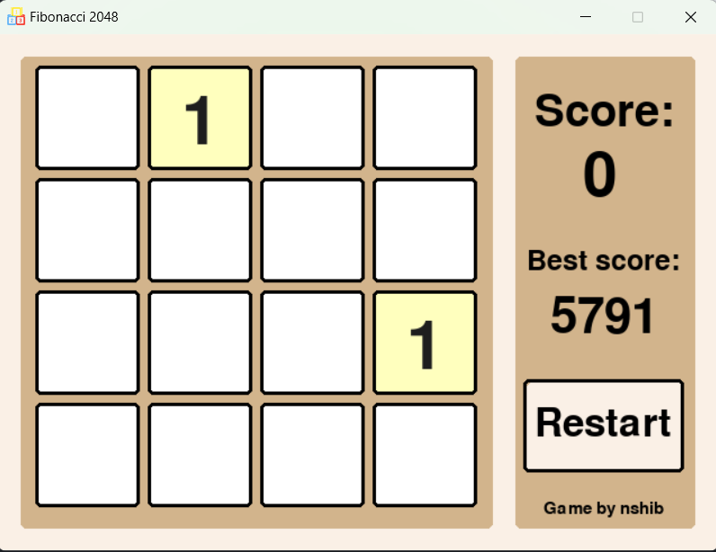

# Fibonacci 2048

A remake of popular game **2048** using Fibonacci numbers (1, 2, 3, 5, 8, ...) instead of powers of two (1, 2, 4, 8, 16, ...).

---

## Gameplay

---

## How to play? 

- Click on arrows (←, →, ↑, ↓) for moving to merge cells with same values.
Merging two cells will increase your score and the value of the merged cell.
- Merge cells until the field is filled with cells that cannot be merged with neighboring cells.

Try to get as high a score as you can :)
